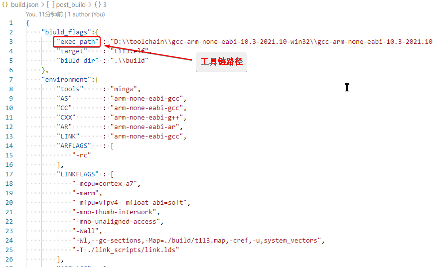
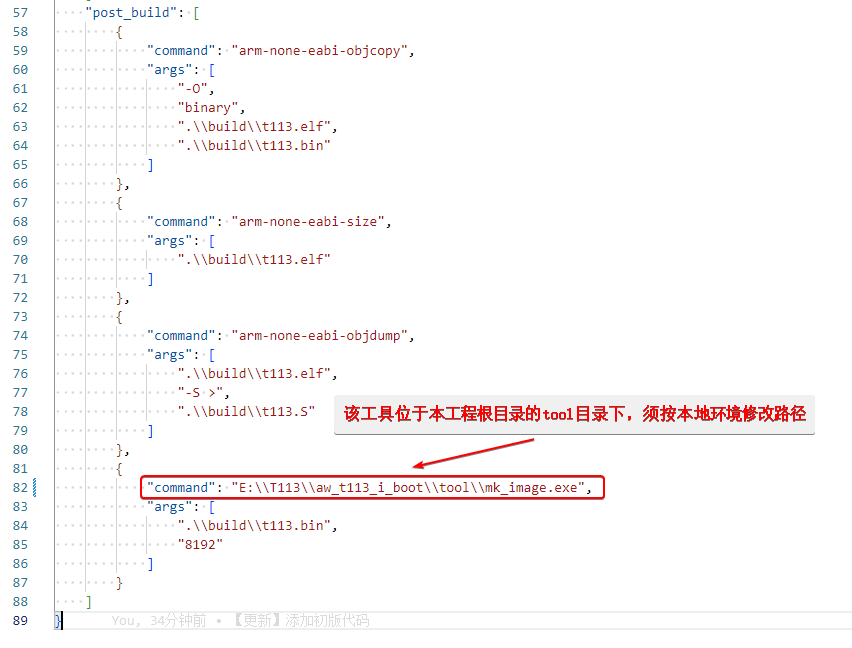
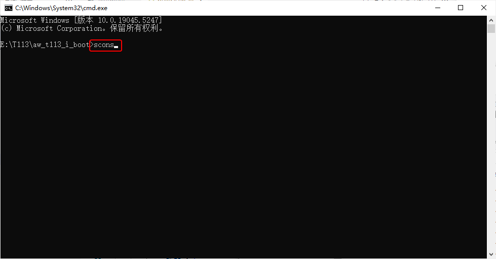
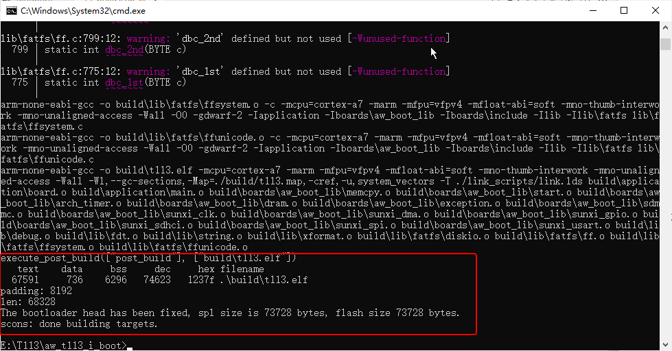
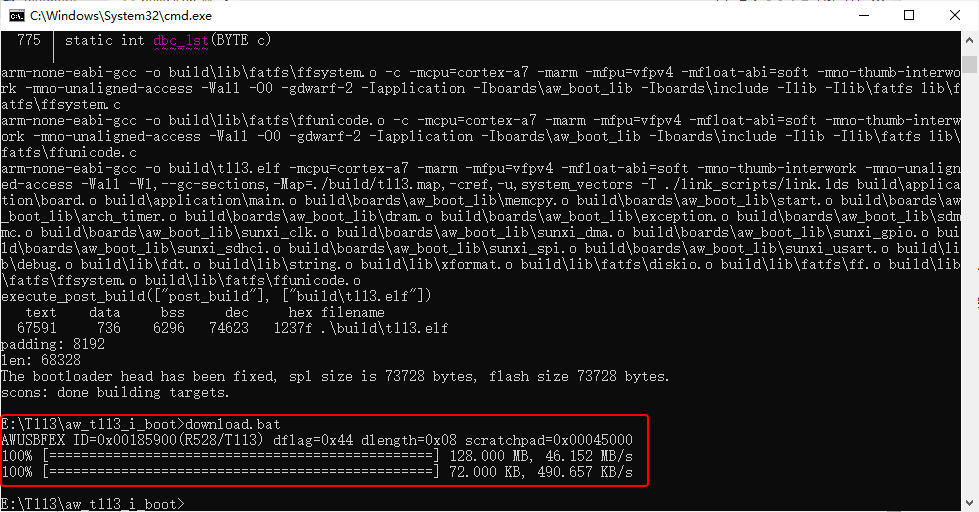
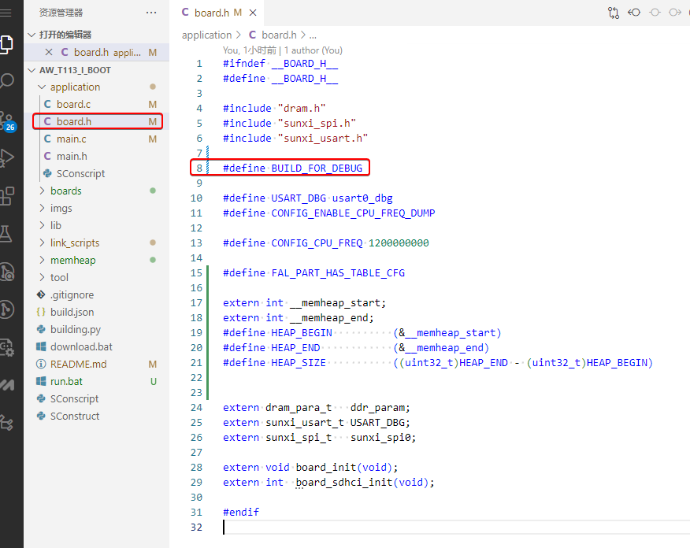
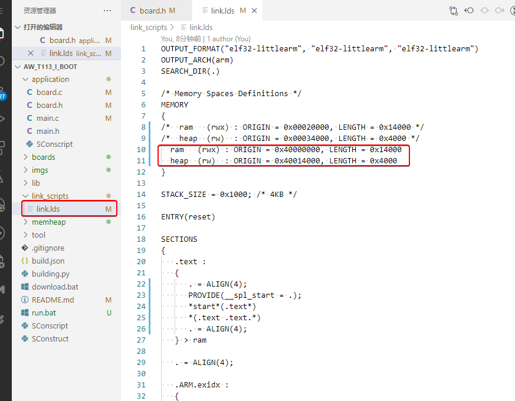
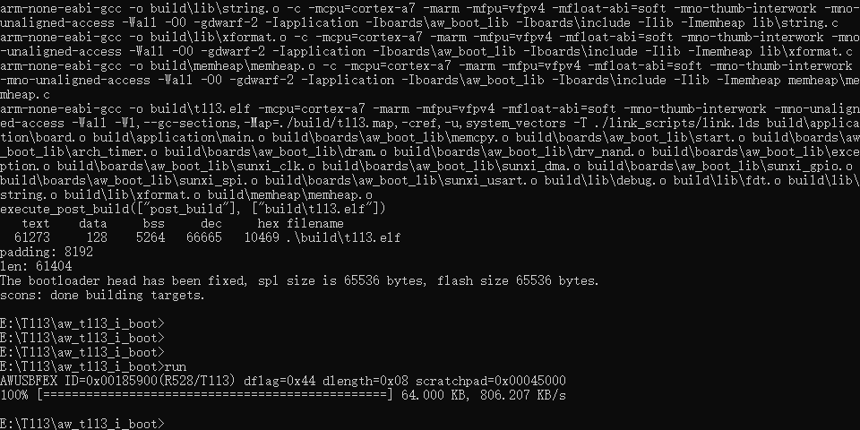
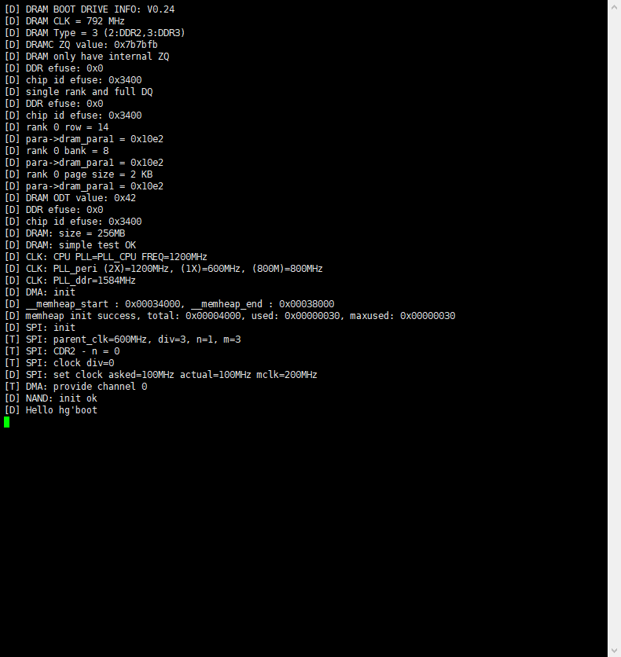
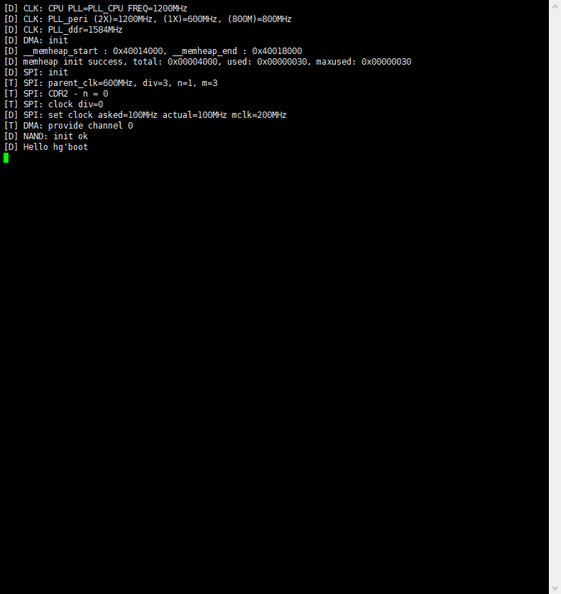

# aw_t113_i_boot
全志 t113-i 裸机工程，使用 xfel 下载到 nand_flash。

# 一、编译

编译前需修改 `.\aw_t113_i_boot\build.json` 文件，匹配本地环境 ，必须修改项如下：

* 修改工具链路径：

* 修改打包工具路径：

本工程使用 `scons` 构建，修改后，只需在 `aw_t113_i_boot` 根目录下打开 `cmd` 输入 `scons` 命令：

***关于该套环境的搭建可见：` https://github.com/SeaDog10/my-scons-template`***

编译完成后会有如下打印：

## 二、下载固化到 NAND_FLASH

下载固化前需使开发板处于 xfel 模式且安装所需驱动，之后在工程根目录输入 `download.bat`:

## 三、使用工具加载到DDR运行

使用此种方式运行需要修改代码.

首先打开 ` board.h` 文件，定义 `BUILD_FOR_DEBUG`:

之后打开 `link.lds` 文件，修改链接地址：

重新编译完成后加载到DDR，此时需使开发板处于 xfel 模式且安装所需驱动，之后在工程根目录输入 `run.bat`:

## 四、运行

若固化到flash，需要复位开发板运行代码，串口输出如下：

若直接加载到DDR运行，则无需复位开发板：

